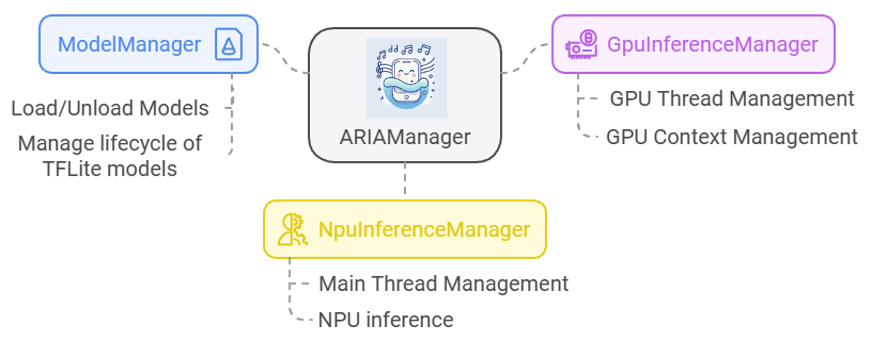
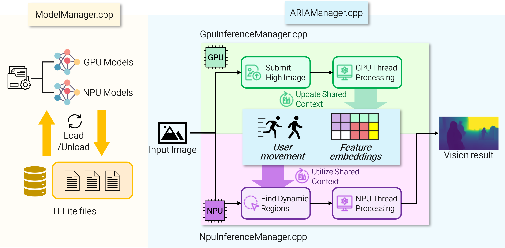

# ARIA
Android source code of ARIA

## Getting started
There are some libraries needed to run ARIA. However, since they are too large, I uploaded some in mobed NAS -> shared -> ARIA.  
You have to do some preparation for launching ARIA.

1. Unzip libs.zip inside app/libs. After doing this, there should be app/libs/qnn and app/libs/tensorflowlite
2. Unzip OpenCV.zip in the very first folder. After doing this, OpenCV folder should be allocated in same place of README.md.

## Folder Structure
```
jni/
├── ARIA/
│   ├── // Codes related to ARIA
├── include/
│   ├── // Header files for QNN
├── Log/
│   ├── // QNN log util files
├── PAL/
│   ├── // QNN loading files
├── QNN/
│   ├── // Header files for QNN
├── Utils/
│   ├── // Utile files for QNN
├── native-lib.cpp  // JNI bridge
├── TFLiteManager.cpp
├── QnnManager.cpp
├── QnnWrapperUtils.cpp
jniLibs/
├── // Library for QNN (with .so model)
...
```

## Benchmark Depth estimation model
Currently, FastDepth, AdaBins, and Depth-Anything-V2 is supported for benchmark depth estimation in Android.   
If you want to add other models, 
1. Push your model using ***adb push \<YOUR MODEL\> /data/local/tmp/***
2. Modify DepthEstimationModel.java, inference.cpp to support your model

## Run ARIA
All the models/datasets should be in /data/local/tmp/aria/.  
If you want to add other models, push your model ***adb push \<YOUR MODEL\> /data/local/tmp/aria/models/*** and modify `ModelManager.cpp`.
If you want to add other datasets, push your model ***adb push \<YOUR DATASET\> /data/local/tmp/aria/datasets/*** and modify `ARIAActivity.java`.

## Demo
<table>
    <tr>
        <td><video src="https://github.com/user-attachments/assets/4f947a12-e1b9-4e7b-a2db-3394a835e7a9"></td>
    </tr>
</table>

## Refactoring finished (2024-12-23~27)
I am refactoring the code to make it more readable and maintainable. Newer version of code will run as follows:
- No global variables. All variables/functions related to ARIA would be controlled in `ARIAManager` class.
- There will be new manager called `ARIAModelManager` which will manage all models. `ARIAModelManager` will be responsible for loading models, running inference, and unloading models related to ARIA.
- I'm trying to make `ARIAManager` as smaller and simpler as possible.    
- Folder structure is also refactored from `com.cyjung.qti.snpe.MonoCon` to `com.cyjung.ARIA`.

***I finished refactoring. For now, I will maintain the current structure and refactor it further if necessary in the future.***

### History for refactoring

2025-01-21: `ModelManager` is splited into `ARIAModelManager` and `TFLiteManager`. Now, `TFLiteManager` is fully responsible for running models as TFLite. Plus, `QnnManager` is implemented for QNN framework.      
2024-12-27: `inference.cpp`, `inference_helper.cpp` are refactored. Unused, unnecessary functions and activities are removed.  
2024-12-26: `GpuInferenceManager`, `NpuInferenceManager` are implemented.  
2024-12-24: `ARIAManager`, `ModelManager` are implemented.  

I tested ARIA in Galaxy S22, Galaxy S23. It works well.

## Overall structure
- `ARIAManager`: Main manager of ARIA. It controls all the variables and functions related to ARIA. Plus, dynamic regions also are managed in this class.
- `ARIAModelManager`: Manages all the models used in ARIA. Currently, TFLite is only supported. All the loading/unloading models are done in this manager.
- `GpuInferenceManager`: Manages all the inference related to GPU. It manages GPU thread and its context.
- `NpuInferenceManager`: Manages all the inference related to NPU. It manages main thread and its context.
- `TFLiteManager`: Fully responsible for building and running model as TFLite.
- `QnnManager`: Fully responsible for building and running model as QNN.  



