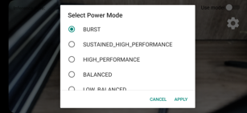
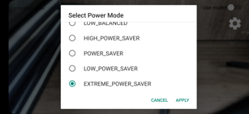

<h1 align='center'> Let's use Qualcomm NPU in Android </h1>

<h3 align='center'> Running your model on mobile devices using NPU </h3>

- Easily create QNN/TFLite models on the server
- A simple app to test a converted model on Android.
- Support FP16/INT8 inference of QNN.

The Goal of this project is to provide guidelines and a sample Android app to use Qualcomm QNN easily. ***Currently, I only tested running QNN model by FP16. I'll keep maintaining this code to support some other DNN models and other arithmetic precisions.***

I tested QNN-Android at the setting below.  
- Android Studio 24.02 Ladybug Feature Drop

## Supported tasks
Currently, I implemented few tasks based on this code. Most models are converted by Qualcomm AI Hub. You can find detailed information for each model at the link provided.
- Image classification
  - [BEiT](https://aihub.qualcomm.com/models/beit)
  - [Swin-Base](https://aihub.qualcomm.com/models/swin_base)
  - [ResNet50](https://aihub.qualcomm.com/models/resnet50)
- Object detection
  - [YOLOv6](https://aihub.qualcomm.com/models/yolov6)
  - [YOLOv7](https://aihub.qualcomm.com/models/yolov7)
  - [DETR-ResNet101](https://aihub.qualcomm.com/models/detr_resnet101)
- Depth estimation  
  - [Depth-Anything-V2](https://github.com/DepthAnything/Depth-Anything-V2)
- Super resolution

## Supported control knobs
### 1. Power configs
QNN supports to control power config, i.e., performance of NPU by using [QNN HTP Performance Infrastructure API](https://docs.qualcomm.com/bundle/publicresource/topics/80-63442-50/htp_backend.html#qnn-htp-performance-infrastructure-api). This code has setting menu to switch power mode.

<table>
  <tr>
    <td></td>
    <td></td>
  </tr>
</table>

## Prerequiste
- Qualcomm® AI Engine Direct setup should be completed by following the guide [here](https://docs.qualcomm.com/bundle/publicresource/topics/80-63442-50/setup.html).
- Android device 6.0 and above can be used to test the application.

## Getting Started
1. Run `resolveAndroidDependencies.sh` to copy QNN NPU libraries to the Android project and download OpenCV library.
```
bash resolveAndroidDependencies.sh
```

2. Add below code snippets to the `QNN-Android/sdk/build.gradle` (build.gradle in OpenCV) since AGP Ladybug has `namespace` features
```gradle
android {
    compileSdkVersion 26
    namespace 'org.opencv'

    defaultConfig {
        namespace 'org.opencv'
        ...
    }
    ...

    buildFeatures {
        aidl = true
        buildConfig = true
    }
}
```

3. Add the models you want to the android project. You can refer the codes in `Server` folder to download model at the Qualcomm AI Hub and convert properly.

4. **Write appropriate preprocessing/postprocessing code for the model. Currently, only pipeline for YOLOv6 model exists.**. Also, current implementation gets the format as below. You have to adjust your model file name like this.
```
${MODEL_NAME}_${PRECISION}.so   # e.g., YOLOv6_FP16.so
```


## Source Overview
### Source Organization
- `QNN-Android`: Simple android demo app code to run QNN model. It's kind of skeleton code.
    - `QNN-Android/app/src/main/java/../tasks/` & `QNN-Android/app/src/main/cpp/Models/`: Model codes that have preprocessing, inference and postprocessing. You can build your own model in here.
    - `QNN-Android/app/src/main/cpp/QnnManager.cpp`: Manager code that has all codes(From initializing to Running) related to QNN model running.
- `Server`: Simple model conversion guidelines using Qualcomm AI Hub.

If you want more specific meanings of each codes, please visit [here](https://docs.qualcomm.com/bundle/publicresource/topics/80-63442-50/sample_app.html?vproduct=1601111740013072&version=1.1&facet=Qualcomm%20AI%20Engine%20Direct%20SDK)